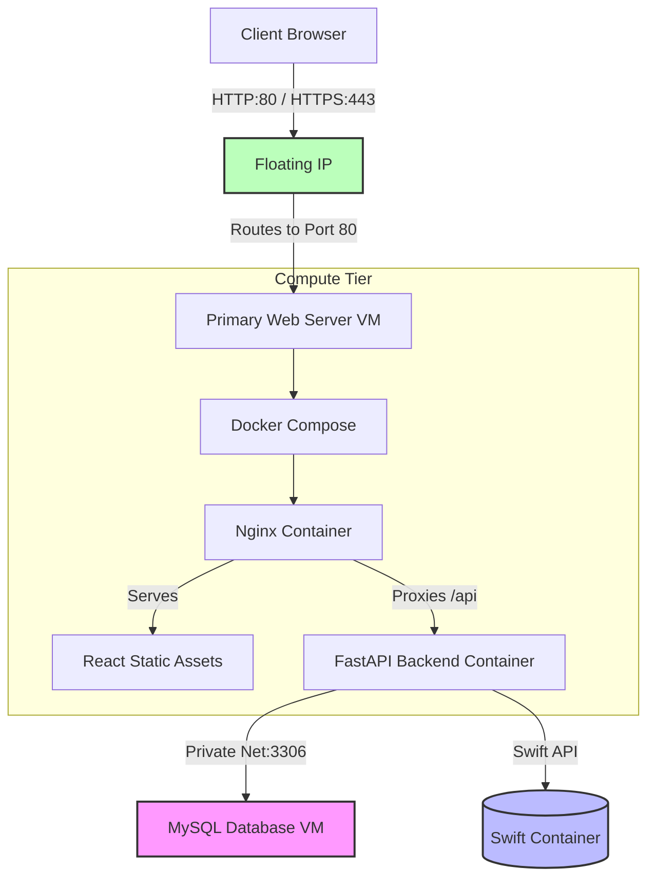

# Pulumi IaC Deployment Manual — OpenStack

This manual describes the infrastructure provisioning and application deployment process for the **Fulda Nexus App** (FastAPI + React + MySQL + Nginx + Swift) on the Fulda University OpenStack cloud using Pulumi.

---

## Architecture Overview



---

## Prerequisites

| Requirement | Notes |
|---|---|
| Python 3.9+ | Required to run Pulumi Python programs |
| Pulumi CLI | `winget install Pulumi.Pulumi` |
| OpenStack credentials | Sourced via `setup-env.ps1` |
| SSH key pair | `fulda-key-new.pem` placed inside `infra/` |

---

## Infra Files

| File | Purpose |
|---|---|
| [`__main__.py`](infra/__main__.py) | Pulumi Python program — defines all OpenStack resources |
| [`deploy.ps1`](infra/deploy.ps1) | End-to-end automation: provision + VM setup |
| [`setup-env.ps1`](infra/setup-env.ps1) | Exports OpenStack and Pulumi environment variables |
| [`Pulumi.yaml`](infra/Pulumi.yaml) | Pulumi project metadata |
| [`requirements.txt`](infra/requirements.txt) | Python dependencies (`pulumi`, `pulumi-openstack`) |

---

## Setup

### 1. Python Virtual Environment

```powershell
cd infra
python -m venv venv
.\venv\Scripts\Activate.ps1
pip install -r requirements.txt
```

### 2. Initialize Pulumi Stack (first time only)

```powershell
pulumi login --local
pulumi stack select dev --create
```

### 3. Stack Configuration Variables

| Config Key | Default | Description |
|---|---|---|
| `key_name` | `CloudComp13-keypair` | OpenStack SSH key pair name |
| `flavor_name` | `m1.small` | Instance flavor |
| `image_name` | `ubuntu-22.04-jammy-server-cloud-image-amd64` | Base OS image |
| `external_network_name` | `ext_net` | External network for floating IPs |
| `db_username` | `fulda_user` | MySQL master user |
| `db_password` | *(secret)* | MySQL master password |
| `db_name` | `fulda_app` | Initial database name |
| `instance_count` | `1` | Number of web server VMs |

`deploy.ps1` sets `db_password` and `key_name` automatically. To set others manually:

```powershell
pulumi config set db_username fulda_user
pulumi config set db_name fulda_app
pulumi config set --secret db_password "YourPassword"
pulumi config set instance_count 1
```

---

## Deployment

### Full Deploy (provision + configure VMs)

```powershell
.\deploy.ps1
```

What this does:
1. Loads environment variables from `setup-env.ps1`
2. Activates the Python `venv`
3. Sets Pulumi config secrets and runs `pulumi up --yes`
4. Polls until Docker and the git-cloned repo are ready on the VM
5. Writes `.env` to `~/app/Backend/.env` via SSH
6. Runs `docker compose up --build -d`
7. Polls for MySQL port `3306` to be reachable
8. Runs `alembic upgrade head` and `seed_events.py`

### VM Setup Only (skip Pulumi, re-configure running VMs)

```powershell
.\deploy.ps1 -Action vm-setup
```

### Destroy Infrastructure

```powershell
.\deploy.ps1 -Action destroy
```

Automatically removes stuck Pulumi state entries for floating IP and compute instances before running `pulumi destroy --yes`.

---

## Stack Outputs

| Output | Description |
|---|---|
| `Web_Primary_Public_IP` | Public floating IP of the primary web server |
| `DB_Private_IP` | Private IP of the MySQL VM |
| `Web_Private_IPs` | Private IP list of all web instances |
| `Swift_Container_Name` | Swift container name (`fulda-assets`) |
| `Network_ID` | Private network ID |
| `Subnet_ID` | Private subnet ID |
| `Router_ID` | Router connecting private subnet to `ext_net` |

Retrieve outputs at any time:

```powershell
pulumi stack output
```

---

## Security Groups

| Group | Rules |
|---|---|
| `fulda-secgroup-web` | Ingress TCP 22 (SSH), 80 (HTTP), 443 (HTTPS) from `0.0.0.0/0` |
| `fulda-secgroup-db` | Ingress TCP 3306 (MySQL) from `fulda-secgroup-web` only |

---

## Tear Down

```powershell
.\deploy.ps1 -Action destroy
```

To also remove the local stack configuration:

```powershell
pulumi stack rm dev
```
